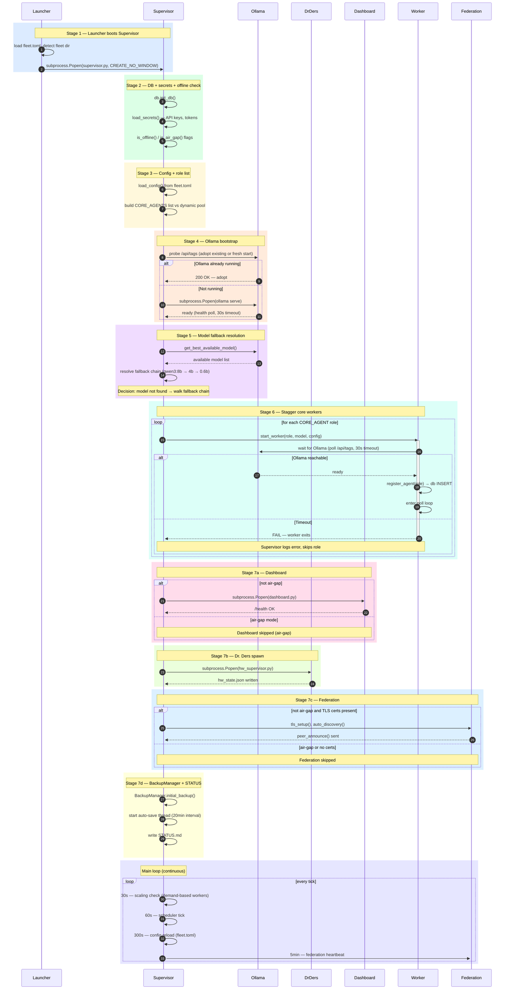

# Core Runtime Swimlanes

Sequence diagrams covering the four core runtime flows in BigEd CC: boot/startup,
task lifecycle, skill execution, and model routing. Each diagram uses participants
as swimlane actors and `alt/else/end` blocks for decision branches.

---

## 1. Boot / Startup Sequence

The full 7-stage startup sequence from the GUI launcher through to the supervisor
entering its main loop. Covers Ollama adoption, model fallback resolution, worker
registration, Dashboard launch, Dr. Ders spawn, Federation setup, and BackupManager
initialization.



---

## 2. Task Lifecycle (Submission → Completion)

A task's full journey from client submission through DB insertion, worker claim,
skill execution, optional adversarial review, intelligence scoring, and final
completion or retry. Covers the atomic claim, OOM guard handoff point, and retry
logic on failure.

```mermaid
sequenceDiagram
    autonumber
    participant C as Client
    participant DB as DB
    participant W as Worker
    participant SE as SkillExecutor
    participant RP as ReviewPipeline

    rect rgb(220, 235, 255)
        Note over C,DB: Submission
        alt REST API
            C->>DB: POST /api/task {skill, payload, priority}
        else lead_client.py
            C->>DB: db.post_task(skill_name, payload, priority)
        end
        DB-->>C: task_id, status=PENDING
    end

    rect rgb(220, 255, 230)
        Note over W: Worker poll loop
        loop every POLL_INTERVAL
            W->>W: heartbeat() — update agent last_seen
            W->>W: check hw_state.json (thermal / VRAM)
            W->>W: process_inbox() — check direct messages
        end
    end

    rect rgb(255, 248, 220)
        Note over W,DB: Atomic claim
        W->>DB: db.claim_task(role, affinity_skills)
        activate W
        DB->>DB: UPDATE tasks SET status=RUNNING WHERE status=PENDING (atomic)
        alt task claimed
            DB-->>W: task row
        else queue depth > 3
            DB-->>W: batch claim 2 tasks
        else no tasks
            W->>W: idle_evolution() after IDLE_THRESHOLD
            deactivate W
        end
    end

    rect rgb(255, 235, 220)
        Note over W,SE: Pre-execution guards
        W->>W: coerce_payload() — normalize types
        W->>W: _watchdog.scan_input() — injection guard
        alt input quarantined
            W->>DB: db.fail_task(task_id, "quarantine")
            Note over W: wait 5min before retry
        else clean
            W->>W: check_ab_test(skill_name)
            W->>SE: run_skill(skill_name, payload, config)
            activate SE
        end
    end

    rect rgb(240, 220, 255)
        Note over SE,W: Execution + result coercion
        SE->>SE: execute skill module (see Diagram 3)
        SE-->>W: raw result dict
        deactivate SE
        W->>W: _coerce_result() — ensure dict format + conventions
    end

    rect rgb(220, 255, 248)
        Note over W,RP: Adversarial review (HIGH_STAKES only)
        alt HIGH_STAKES skill
            W->>RP: adversarial_review(result)
            activate RP
            RP->>RP: independent re-evaluation
            alt PASS
                RP-->>W: approved
                deactivate RP
            else FAIL
                RP-->>W: rejected + reason
                deactivate RP
                W->>DB: db.requeue_task(task_id)
                Note over W: re-enters PENDING queue
            end
        end
    end

    rect rgb(255, 220, 235)
        Note over W,DB: Scoring + completion
        W->>W: score_task_output() — Tier1 + Tier2 blended IQ score
        W->>DB: db.complete_task(task_id, result, score)
        DB->>DB: mark DONE, promote dependent tasks
        deactivate W
    end

    rect rgb(235, 235, 255)
        Note over W,DB: Failure path
        alt exception raised
            W->>DB: db.fail_task(task_id, error)
            alt retries < max_rounds
                DB->>DB: increment retry_count, status=PENDING
            else max_rounds reached
                DB->>DB: status=FAILED (terminal)
            end
        end
    end
```

---

## 3. Skill Execution Pipeline

The internal pipeline inside `run_skill()`, from suite routing and security gating
through OOM checks, optional Docker sandboxing, module import, timed execution, and
result validation. Covers every guard layer a skill call passes through before the
module's `run()` function is invoked.

```mermaid
sequenceDiagram
    autonumber
    participant W as Worker
    participant SR as SuiteRouter
    participant SG as SecurityGate
    participant OG as OOMGuard
    participant SM as SkillModule
    participant DS as DockerSandbox
    participant RV as ResultValidator

    rect rgb(220, 235, 255)
        Note over W,SR: Suite routing
        W->>SR: run_skill(skill_name, payload, config)
        activate SR
        SR->>SR: check SUITE_ROUTING dict
        alt skill in suite map
            SR->>SR: remap skill_name, inject action key
        end
        SR-->>W: resolved (skill_name, payload)
        deactivate SR
    end

    rect rgb(255, 248, 220)
        Note over W,SG: Security gate
        W->>SG: check(skill_name, config)
        activate SG
        alt air-gap mode
            SG->>SG: skill in AIR_GAP_SKILLS?
            alt not in whitelist
                SG-->>W: BLOCKED (air-gap)
                deactivate SG
                Note over W: return error result immediately
            end
        end
        SG->>SG: REQUIRES_NETWORK flag on module
        alt REQUIRES_NETWORK and is_air_gap()
            SG-->>W: BLOCKED (network required)
            deactivate SG
        else allowed
            SG-->>W: PASS
            deactivate SG
        end
    end

    rect rgb(255, 235, 220)
        Note over W,OG: OOM guard
        W->>OG: check_oom_risk(skill_name)
        activate OG
        OG->>OG: read hw_state.json (VRAM free, RAM free)
        alt VRAM critical
            OG-->>W: BLOCK — insufficient VRAM
            deactivate OG
            Note over W: return error result immediately
        else safe
            OG-->>W: OK
            deactivate OG
        end
    end

    rect rgb(220, 255, 230)
        Note over W,SM: Skill validation
        W->>W: _is_valid_skill(skill_name)
        alt skill file not on filesystem
            W-->>W: return error — unknown skill
        end
    end

    rect rgb(240, 220, 255)
        Note over W,DS: Docker sandboxing
        alt skill is sandboxable AND Docker daemon available
            W->>DS: run_in_container(skill_name, payload)
            activate DS
            DS->>DS: docker run --rm --network=none biged-skill
            DS-->>W: stdout result JSON
            deactivate DS
        else no Docker or not sandboxable
            Note over W: execute in-process (next steps)
        end
    end

    rect rgb(220, 255, 248)
        Note over W,SM: Module import + timed execution
        W->>SM: importlib.import_module("skills.{skill_name}")
        activate SM
        W->>W: start thread + join(SKILL_TIMEOUTS.get(skill) or 600s)
        W->>SM: module.run(payload, config)
        alt execution completes within timeout
            SM-->>W: raw result dict
            deactivate SM
        else timeout exceeded
            W-->>W: raise TimeoutError
            Note over W: skill killed, return timeout error
        end
    end

    rect rgb(255, 220, 235)
        Note over W,RV: Result validation
        W->>RV: _coerce_result(raw)
        activate RV
        RV->>RV: ensure dict, inject status/result keys
        RV->>RV: strip oversized payloads
        RV-->>W: validated result dict
        deactivate RV
    end
```

---

## 4. Model Routing & Fallback Chain

How `providers.py` selects a model for each LLM call: complexity mapping to tier,
circuit-breaker state per provider, cascading fallback from Claude → Gemini →
MiniMax → local Ollama, and Ollama's own internal fallback chain.

```mermaid
sequenceDiagram
    autonumber
    participant W as Worker
    participant P as Providers
    participant CL as Claude
    participant GM as Gemini
    participant MM as MiniMax
    participant OL as Ollama
    participant CB as CircuitBreaker

    rect rgb(220, 235, 255)
        Note over W,P: Complexity → tier mapping
        W->>P: get_optimal_model(skill_name) or call_complex(prompt)
        activate P
        P->>P: read COMPLEXITY from skill module (simple/medium/complex)
        P->>P: map tier: simple→Haiku | medium→Sonnet | complex→Opus
        Note over P: Budget exceeded → downgrade tier one step
    end

    rect rgb(220, 255, 230)
        Note over P,CL: Primary provider — Claude
        P->>CB: state(provider="claude")
        activate CB
        alt circuit CLOSED
            CB-->>P: OK
            deactivate CB
            P->>CL: API call (mapped model, prompt)
            activate CL
            alt success
                CL-->>P: response
                deactivate CL
                P-->>W: response
                deactivate P
            else failure
                CL-->>P: error / timeout
                deactivate CL
                P->>CB: record_failure("claude")
                CB->>CB: 3 failures in 5min → state=OPEN
            end
        else circuit OPEN
            CB-->>P: SKIP
            deactivate CB
            Note over P,CL: Claude bypassed
        end
    end

    rect rgb(255, 248, 220)
        Note over P,GM: Fallback 1 — Gemini
        P->>CB: state(provider="gemini")
        activate CB
        alt circuit CLOSED and API key present
            CB-->>P: OK
            deactivate CB
            P->>GM: API call (equivalent model tier)
            activate GM
            alt success
                GM-->>P: response
                deactivate GM
                P-->>W: response
                deactivate P
            else failure
                GM-->>P: error
                deactivate GM
                P->>CB: record_failure("gemini")
            end
        else circuit OPEN or no key
            CB-->>P: SKIP
            deactivate CB
        end
    end

    rect rgb(255, 235, 220)
        Note over P,MM: Fallback 2 — MiniMax
        P->>CB: state(provider="minimax")
        activate CB
        alt circuit CLOSED and API key present
            CB-->>P: OK
            deactivate CB
            P->>MM: API call (M2.5)
            activate MM
            alt success
                MM-->>P: response
                deactivate MM
                P-->>W: response
                deactivate P
            else failure
                MM-->>P: error
                deactivate MM
                P->>CB: record_failure("minimax")
            end
        else circuit OPEN or no key
            CB-->>P: SKIP
            deactivate CB
        end
    end

    rect rgb(240, 220, 255)
        Note over P,OL: Fallback 3 — Local Ollama
        P->>OL: query available models (/api/tags)
        activate OL
        P->>P: map complexity to local model
        alt simple
            P->>OL: qwen3:4b (conductor / CPU)
        else medium or complex
            P->>OL: qwen3:8b (default GPU)
        end

        alt requested model available
            OL-->>P: response
            deactivate OL
            P-->>W: response
            deactivate P
        else qwen3:8b unavailable
            Note over P,OL: Internal Ollama fallback
            P->>OL: qwen3:4b
            alt qwen3:4b available
                OL-->>P: response
                deactivate OL
                P-->>W: response
                deactivate P
            else qwen3:4b also unavailable
                P->>OL: qwen3:0.6b (failsafe CPU)
                OL-->>P: response
                deactivate OL
                P-->>W: response (failsafe)
                deactivate P
            end
        end
    end

    rect rgb(255, 220, 235)
        Note over P,W: All providers failed
        alt every provider exhausted
            P-->>W: error — no provider available
            deactivate P
            Note over W: task fails, logged to db
        end
    end
```
