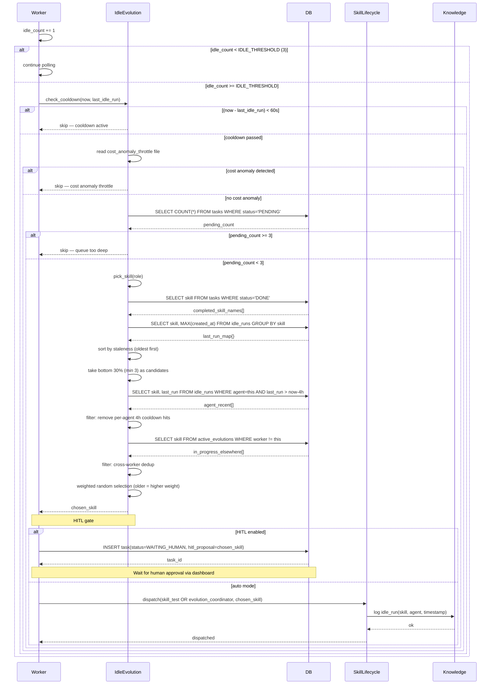
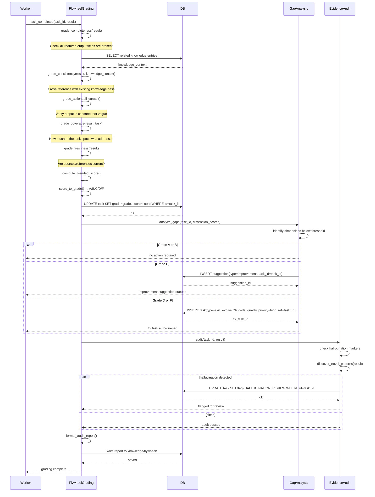
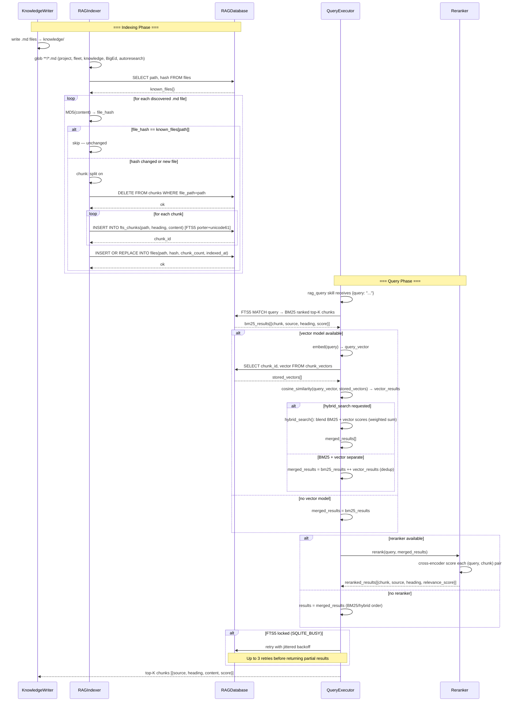

# Intelligence Loop — Swimlane Diagrams

Workflows 5–8 cover the self-improvement and knowledge systems that run continuously
alongside the task fleet: idle-time skill evolution, quality grading, ML experimentation,
and RAG ingestion/querying.

---

## 5. Idle Evolution

When a worker finds no tasks for `IDLE_THRESHOLD` (3) consecutive polls, it enters the
idle evolution path. Multiple guards (cooldown, cost anomaly, queue depth, per-agent and
cross-worker dedup) prevent runaway evolution. HITL mode gates the final dispatch behind
human approval; in fully-automated mode the skill is dispatched immediately.



---

## 6. Quality Flywheel

Every completed task passes through a six-dimension grading pipeline. The blended A–F
grade drives automatic follow-up: high grades need no action; mid-tier grades surface
suggestions; failing grades auto-queue targeted fix tasks. An evidence audit runs in
parallel to flag potential hallucinations.



---

## 7. ML Experiment Pipeline

Agents propose experiments (new models, routing changes, prompt strategies). A risk
threshold gate decides whether to auto-approve or hold for human sign-off. After training
and evaluation, results are compared to the current baseline: improvements deploy
automatically; regressions trigger rollback.

```mermaid
sequenceDiagram
    participant Agent
    participant ExperimentFramework
    participant DB
    participant TrainFn
    participant EvalFn
    participant Deployer

    Agent->>ExperimentFramework: fw.propose(agent, type, hypothesis, config)
    ExperimentFramework->>DB: INSERT experiment(status=PROPOSED, agent, type, hypothesis, config)
    DB-->>ExperimentFramework: exp_id

    ExperimentFramework->>ExperimentFramework: assess_risk(config)
    alt risk < auto_approve_below_risk threshold
        ExperimentFramework->>DB: UPDATE experiment SET status=APPROVED WHERE id=exp_id
        DB-->>ExperimentFramework: ok
        Note over ExperimentFramework: Auto-approved — proceed immediately
    else risk >= threshold
        ExperimentFramework-->>Agent: status=PROPOSED — awaiting approval
        Note over Agent,ExperimentFramework: Human or orchestrator reviews and approves
        Agent->>ExperimentFramework: approve(exp_id)
        ExperimentFramework->>DB: UPDATE experiment SET status=APPROVED WHERE id=exp_id
        DB-->>ExperimentFramework: ok
    end

    ExperimentFramework->>ExperimentFramework: fw.run(exp_id, train_fn, eval_fn)
    ExperimentFramework->>DB: UPDATE experiment SET status=RUNNING WHERE id=exp_id
    DB-->>ExperimentFramework: ok

    ExperimentFramework->>TrainFn: train_fn(config)
    TrainFn->>TrainFn: execute training job
    TrainFn-->>ExperimentFramework: model_artifact

    ExperimentFramework->>EvalFn: eval_fn(config, model_artifact)
    EvalFn->>EvalFn: evaluate: accuracy, latency, resource usage
    EvalFn-->>ExperimentFramework: metrics{accuracy, latency, ...}

    ExperimentFramework->>DB: UPDATE experiment SET status=COMPLETED, metrics=metrics WHERE id=exp_id
    DB-->>ExperimentFramework: ok

    ExperimentFramework->>DB: SELECT metrics FROM experiment WHERE status=DEPLOYED ORDER BY deployed_at DESC LIMIT 1
    DB-->>ExperimentFramework: baseline_metrics

    ExperimentFramework->>ExperimentFramework: compare(metrics, baseline_metrics)
    alt improvement > deploy_threshold
        ExperimentFramework->>Deployer: deploy(exp_id, model_artifact)
        Deployer->>DB: UPDATE experiment SET status=DEPLOYED WHERE id=exp_id
        DB-->>Deployer: ok
        Deployer->>Deployer: activate model/artifact in routing layer
        Deployer-->>ExperimentFramework: deployed
        ExperimentFramework->>ExperimentFramework: monitor post-deploy metrics
        Note over ExperimentFramework,Deployer: Track metrics; regression → rollback
    else regression or no improvement
        ExperimentFramework->>DB: UPDATE experiment SET status=REJECTED WHERE id=exp_id
        DB-->>ExperimentFramework: ok
        ExperimentFramework-->>Agent: experiment rejected — baseline retained
    end
```

---

## 8. RAG Pipeline (Ingest → Index → Query → Rerank)

The RAG system has two halves: an incremental indexer that hashes files and only
re-chunks changed content into the FTS5 virtual table, and a query path that supports
BM25 keyword search, optional vector/hybrid search, and optional cross-encoder reranking.


