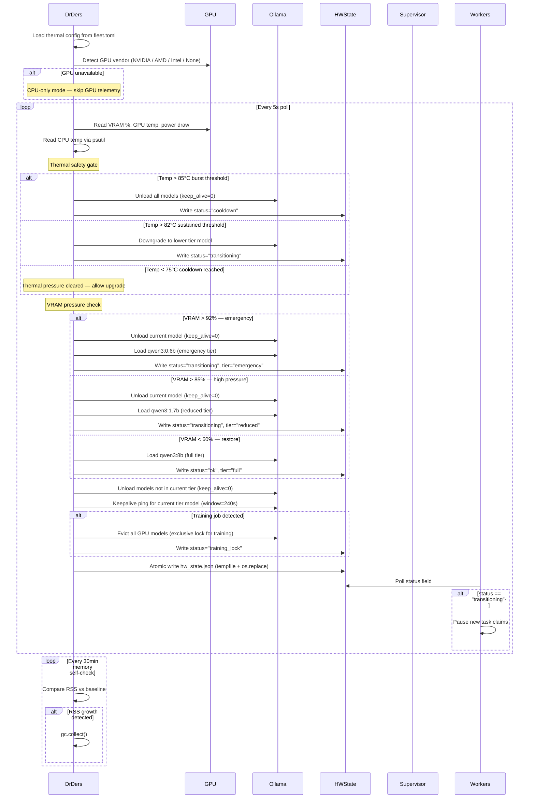
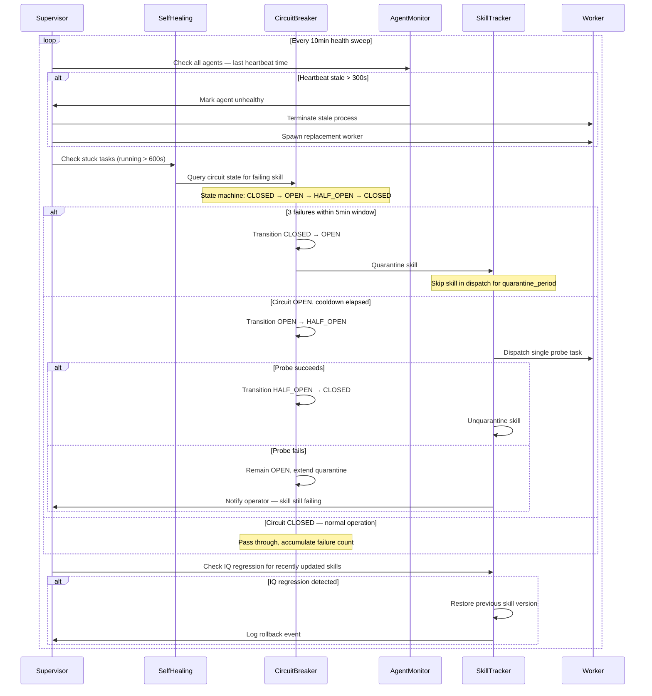
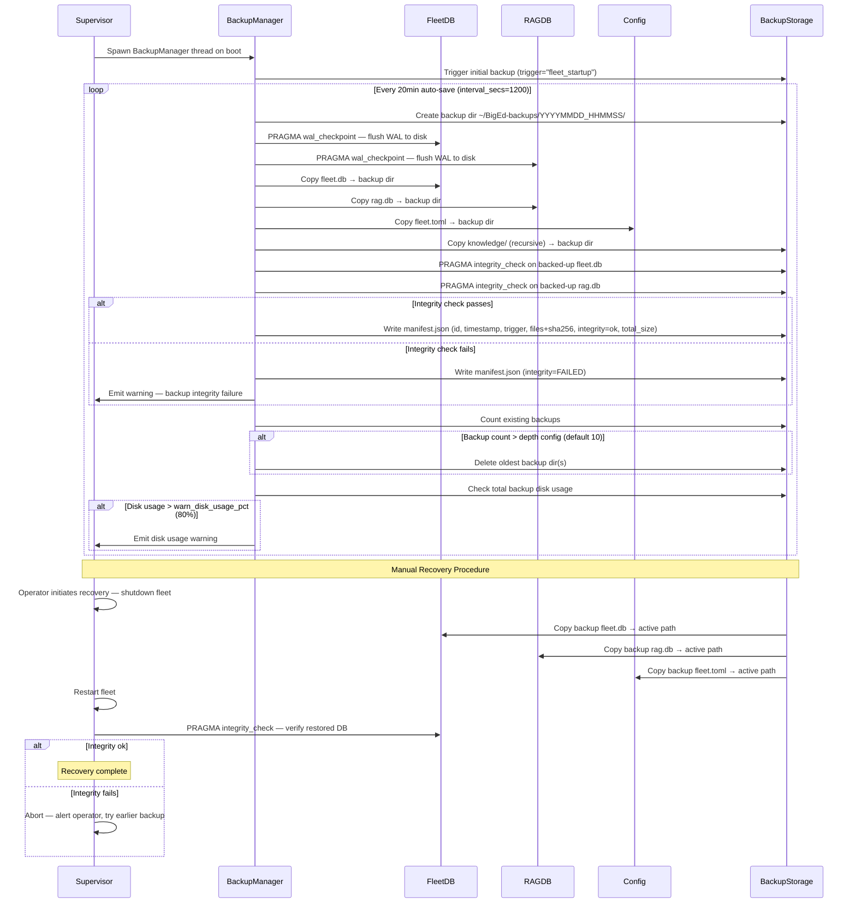

# Operations Swimlane Diagrams

Covers: Dr. Ders Health Monitoring, Self-Healing & Circuit Breaker, Backup/Recovery, Dashboard API.

---

## 9. Dr. Ders Health Monitoring



---

## 10. Self-Healing & Circuit Breaker



---

## 11. Backup / Recovery



---

## 12. Dashboard API

```mermaid
sequenceDiagram
    participant Client
    participant Flask
    participant SecurityMiddleware
    participant RateLimiter
    participant DB
    participant SSEClients

    Client->>Flask: HTTP request (port 5555)

    Flask->>SecurityMiddleware: before_request hooks

    SecurityMiddleware->>SecurityMiddleware: CORS origin check
    alt CORS mismatch
        SecurityMiddleware-->>Client: 403 Forbidden
    end

    SecurityMiddleware->>SecurityMiddleware: CSRF token validation (POST/PUT/DELETE)
    alt CSRF token invalid or missing
        SecurityMiddleware-->>Client: 403 Forbidden
    end

    SecurityMiddleware->>RateLimiter: Check rate limit (default 10 req/min)
    alt Rate limit exceeded
        RateLimiter-->>Client: 429 Too Many Requests
    end

    SecurityMiddleware->>SecurityMiddleware: Extract role from header/session
    alt Role lacks permission for route
        SecurityMiddleware-->>Client: 403 Forbidden
    end

    Flask->>Flask: Route dispatch — match URL to handler
    Flask->>DB: Execute handler query
    DB-->>Flask: Return result set
    Flask-->>Client: JSON response + headers

    Flask->>Flask: after_request — audit logging
    Note over Flask: GET ops logged at 10% sample rate; all write ops logged at 100%

    alt Write operation (POST/PUT/DELETE/PATCH)
        Flask->>SSEClients: _broadcast_sse({type, data}) to all connected clients
    end

    Note over Client,SSEClients: SSE streaming connection

    Client->>Flask: GET /api/events (SSE endpoint)
    Flask->>SSEClients: Register client in SSE client list
    loop While client connected
        SSEClients-->>Client: Stream server-sent events on write ops
    end
```
