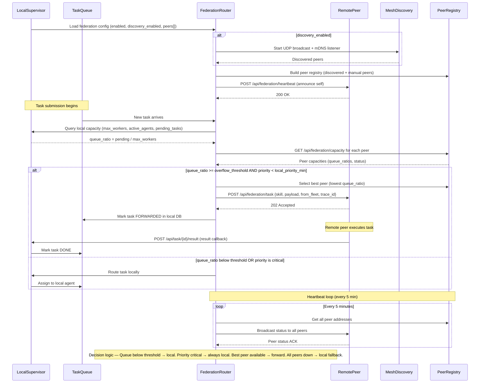
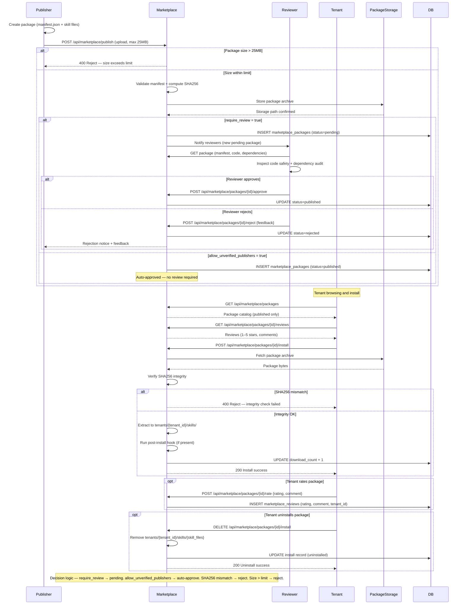
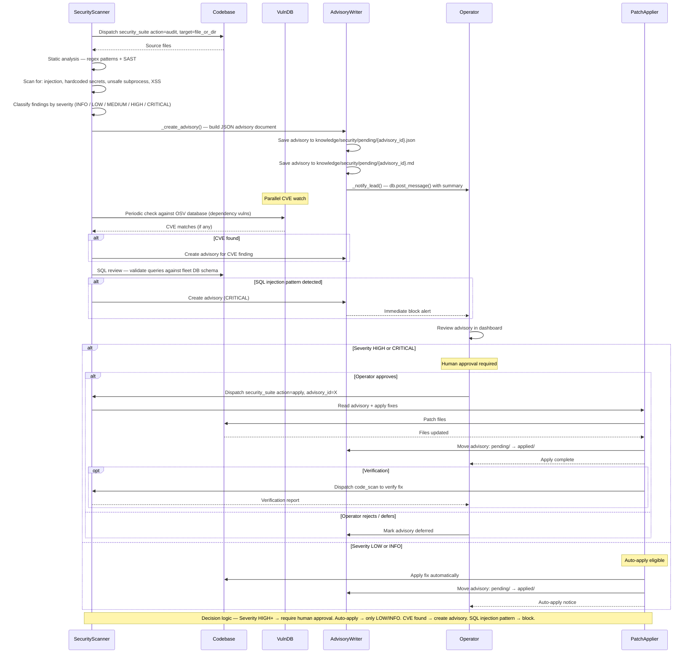
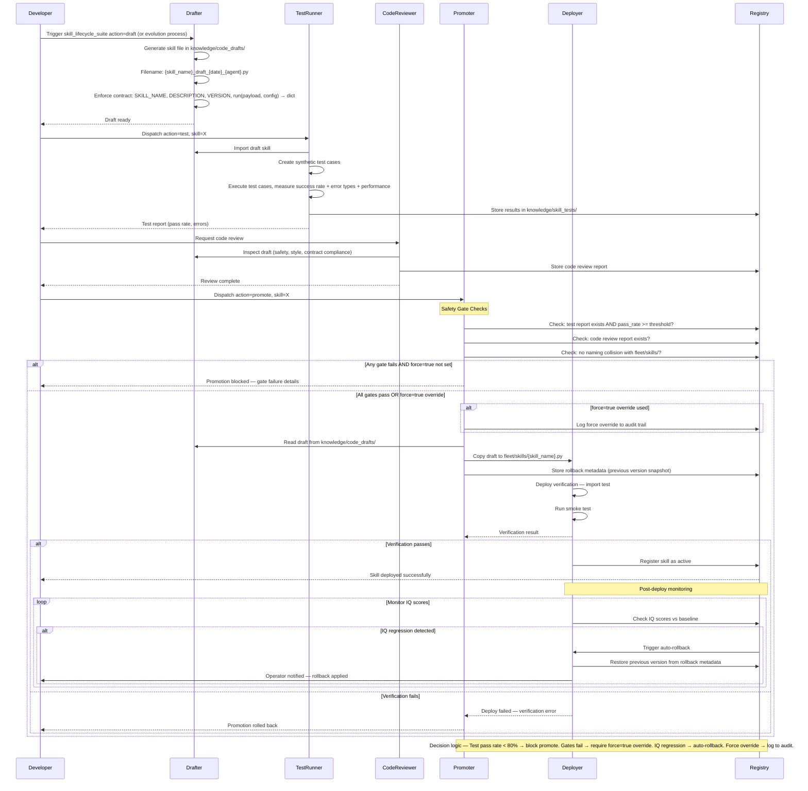

# BigEd CC — Enterprise Swimlanes

Sequence diagrams covering federation, marketplace, security, and skill lifecycle workflows.

---

## 13. Federation — Cross-Fleet Task Routing

---

## 14. Marketplace — Publish → Review → Install

---

## 15. Security Pipeline — Audit → Advisory → Apply

---

## 16. Skill Lifecycle — Draft → Test → Promote → Deploy

